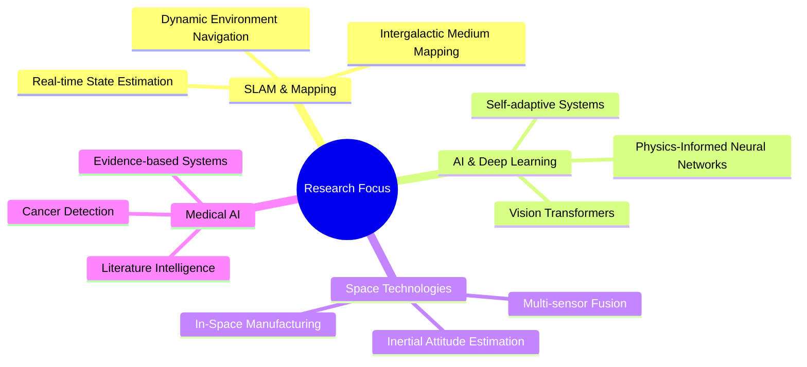

    

    

> *"Whether I'm mapping dynamic environments on Earth or charting the intergalactic medium, SLAM and reconstruction algorithms are where my heart truly lies. It's not just work—it's where science meets adventure! 🚀"*

# 🎓 Academic & Professional Journey

**Arman Asgharpoor Golroudbari, M.Sc.**
- 📡 Space Engineering Graduate, University of Tehran (GPA: 4.00/4.00)
- 🛩️ Avionics Engineering Background (GPA: 3.80/4.00)
- 🔬 Senior AI Research Associate at Rajaei Cardiovascular Center
- 🤖 AI Research Engineer at MHS Company

## 🌟 Latest Research

### 📝 Publications & Preprints
- "TE-PINN: Quaternion-Based Orientation Estimation using Transformer-Enhanced Physics-Informed Neural Networks" (ICRA 2025, Under review)
- "End-to-End Deep Learning Framework for Real-Time Inertial Attitude Estimation using 6DoF IMU" (Measurement, 2023)
- "Recent Advancements in Deep Learning Applications and Methods for Autonomous Navigation" (Arxiv 2023)
- "The Future of In-Space Manufacturing: A Systematic Review" (75th IAC 2024)

## 🔬 Research Impact

## 💫 Notable Achievements

### 🏆 Recent Recognition
- Outstanding Reviewer, IEEE Transactions on Instrumentation & Measurement (2023)
- AWS AI & ML Scholarship Recipient (2023)
- Ranked 1st in OxML Competition, Oxford ML Summer School (2023)
- Top 10% in M.Sc. Aerospace Engineering National Entrance Exam

### 🔧 Technical Arsenal

#### Core Expertise

#### Development Tools

## 📊 Research Impact Metrics

    

    
    

## 🌐 Connect & Collaborate

    
    
    

    
    
    

---

    <h3>🌌 Always Exploring New Frontiers in AI & Space Technology</h3>
    
<i>From Earth to the stars, making autonomous navigation smarter, one algorithm at a time</i>

