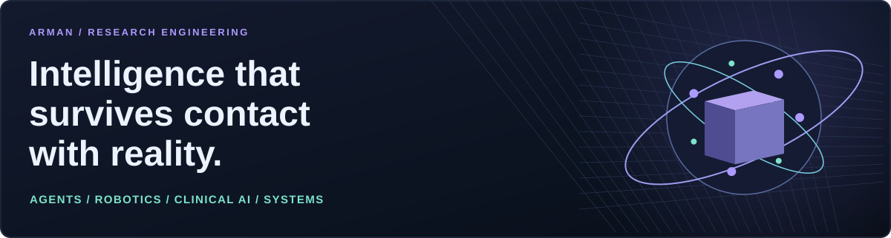
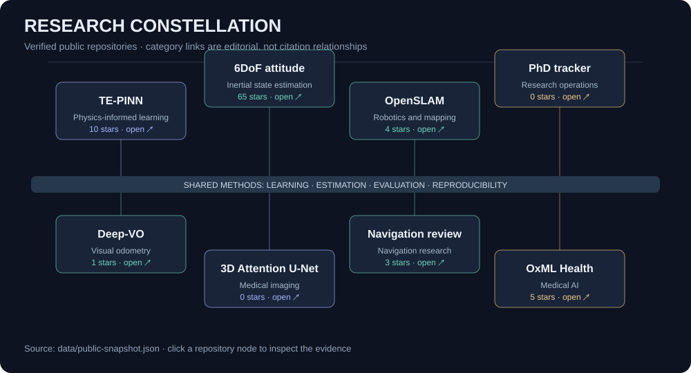
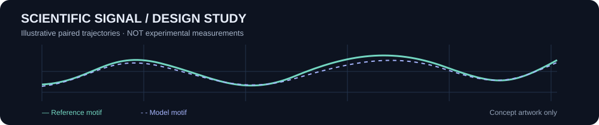
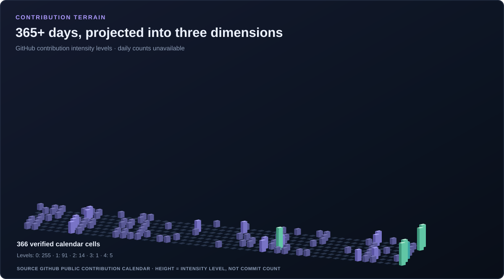

<strong>Intelligence, grounded in systems.</strong>

Agentic reasoning · Robotic perception · Physics-informed learning · Evidence-grounded AI

<a href="#research-constellation">Research constellation</a> · <a href="#contribution-streak">Contribution streak</a> · <a href="#scientific-signal">Scientific signal</a> · <a href="#research-chronicle">Chronicle</a> · <a href="#selected-systems">Selected systems</a>

## Research constellation

An original research atlas of publicly verifiable projects. Each node links to its repository; connections represent curated research domains rather than inferred scientific citations.

## Contribution streak

## Scientific signal

## Selected systems

| Project | Area | Public stars |
|:--|:--|--:|
| [TE-PINN](https://github.com/Armanasq/TE-PINN-Transformer-Enhanced-Physics-Informed-Neural-Network-Quaternion-Orientation-Estimation) | Physics-informed learning | 10 |
| [6DoF attitude](https://github.com/Armanasq/End-to-End-Deep-Learning-Framework-for-Real-Time-Inertial-Attitude-Estimation-using-6DoF-IMU) | Inertial state estimation | 65 |
| [OpenSLAM](https://github.com/Armanasq/OpenSLAM) | Robotics and mapping | 4 |
| [PhD tracker](https://github.com/Armanasq/phd_tracker) | Research operations | 0 |
| [Deep-VO](https://github.com/Armanasq/Deep-VO) | Visual odometry | 1 |
| [3D Attention U-Net](https://github.com/Armanasq/3D-Attention-U-Net-for-Multiple-Sclerosis-Lesion-Segmentation) | Medical imaging | 0 |
| [Navigation review](https://github.com/Armanasq/Recent-Advancements-in-Deep-Learning-Applications-and-Methods-for-Autonomous-Navigation) | Navigation research | 3 |
| [OxML Health](https://github.com/Armanasq/The-Health-and-Medicine-OxML-competition-track) | Medical AI | 5 |

<b>Public GitHub contribution landscape</b>

---

[Atlas methodology](./docs/RESEARCH_ATLAS.md) · [GitHub API snapshot](./data/public-snapshot.json) · [Automated refresh](./.github/workflows/profile.yml) · [Source integrations](./docs/UPSTREAM_INTEGRATIONS.md)
